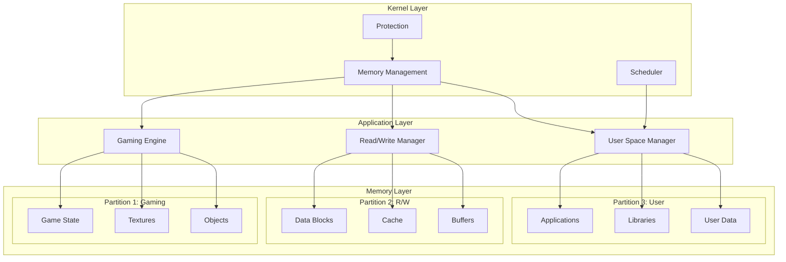
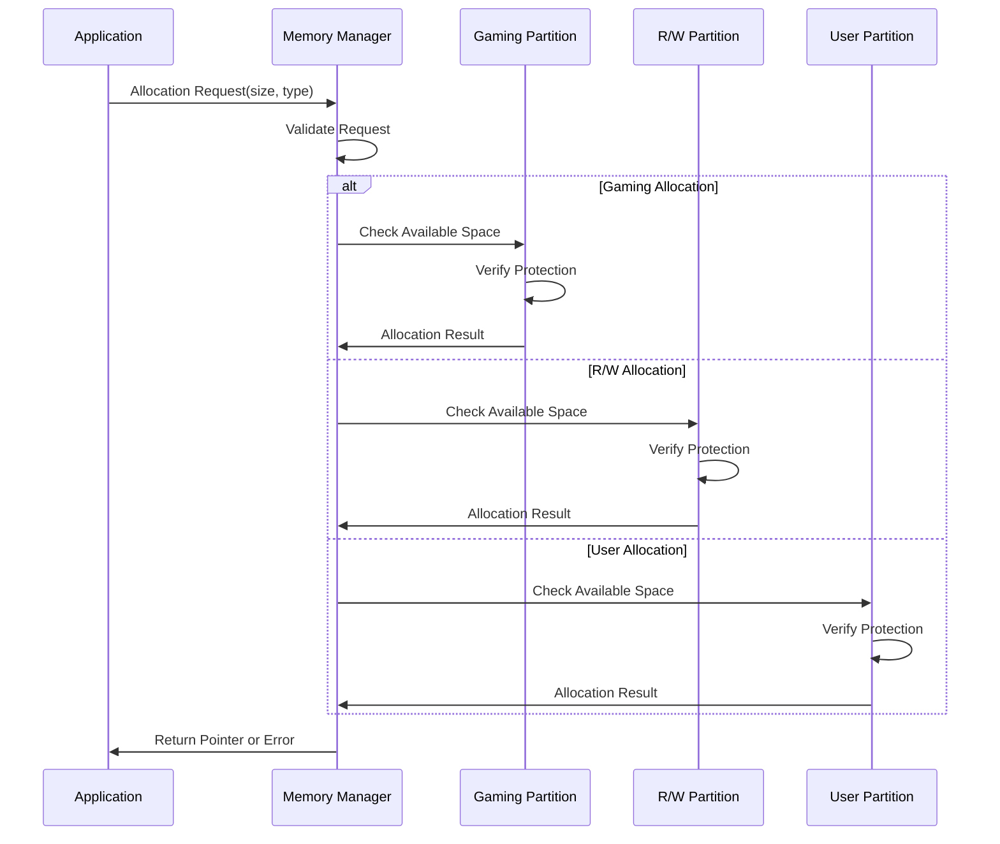

# DDR RAM Partition System 


##  Table of Contents
- [Overview](#overview)
- [Features](#features)
- [Architecture](#architecture)
- [Installation](#installation)
- [Usage](#usage)
- [Workflow](#workflow)
- [API Documentation](#api-documentation)
- [Examples](#examples)
- [Testing](#testing)
- [Contributing](#contributing)
- [License](#license)
- [Contact](#contact)

## 🎯 Overview

A sophisticated simulated DDR RAM memory management system with three distinct partitions for different application domains. This project demonstrates memory management, partition isolation, and application-specific memory optimization techniques.

**Key Highlights:**
-  **Gaming Partition**: Optimized for high-performance game data
-  **Read/Write Partition**: Efficient data processing and storage
-  **User Space Partition**: Application management and user data
-  **Memory Protection**: Isolated partitions with different access rights
-  **Performance Monitoring**: Real-time metrics and statistics

##  Features

###  **Gaming Partition**
- Game state management
- Texture and object storage
- Physics engine data
- Frame buffer management
- Real-time performance tracking

###  **Read/Write Partition**
- Data block management
- Efficient read/write operations
- Checksum verification
- Benchmarking tools
- Defragmentation simulation

###  **User Space Partition**
- Application lifecycle management
- Memory allocation for user apps
- Garbage collection simulation
- Process scheduling
- Event handling system

###  **System Features**
- Startup sequence simulation
- Memory protection mechanisms
- Inter-partition communication
- Error handling and recovery
- Comprehensive testing suite

##  Architecture

### Memory Layout
```
┌─────────────────────────────────────────────────────────────┐
│                   768 MB DDR MEMORY                          │
├─────────────────────────────────────────────────────────────┤
│  Partition 1: Gaming (256MB)                                │
│  ├── Game State ┌── Textures ┌── Game Objects              │
│  ├── Physics Data └── Audio └── Render Buffers             │
│  │  Base: 0x00000000, End: 0x0FFFFFFF                     │
│  │  Protection: READ | WRITE | EXECUTE                     │
│                                                             │
│  Partition 2: Read/Write (256MB)                           │
│  ├── Data Blocks ┌── Cache ┌── Buffers                     │
│  ├── File System └── Logs └── Temp Data                    │
│  │  Base: 0x10000000, End: 0x1FFFFFFF                     │
│  │  Protection: READ | WRITE                               │
│                                                             │
│  Partition 3: User Space (256MB)                           │
│  ├── Applications ┌── Libraries ┌── Stack/Heap             │
│  ├── GUI Apps └── Services └── User Data                  │
│  │  Base: 0x20000000, End: 0x2FFFFFFF                     │
│  │  Protection: READ | WRITE | EXECUTE                     │
└─────────────────────────────────────────────────────────────┘
```

### System Architecture Diagram


##  Installation

### Prerequisites
- GCC or Clang compiler
- CMake (version 3.10 or higher)
- Make build system
- Git

### Build Instructions

#### Method 1: Using Build Script (Recommended)
```bash
# Clone the repository
git clone https://github.com/yourusername/ddr-ram-partition-system.git
cd ddr-ram-partition-system

# Make the build script executable
chmod +x scripts/build_and_run.sh

# Build and run
./scripts/build_and_run.sh
```

#### Method 2: Manual Build
```bash
# Clone the repository
git clone https://github.com/yourusername/ddr-ram-partition-system.git
cd ddr-ram-partition-system

# Create build directory
mkdir build && cd build

# Configure with CMake
cmake ..

# Build the project
make -j$(nproc)

# Run the application
./ddr_ram_system

# Run tests
./ddr_test_suite
```

#### Method 3: Docker Build
```bash
# Build Docker image
docker build -t ddr-ram-system .

# Run in container
docker run -it ddr-ram-system
```

##  Usage

### Basic Execution
```bash
./ddr_ram_system
```

### Command Line Options
```bash
# Run with verbose output
./ddr_ram_system --verbose

# Run specific demo only
./ddr_ram_system --demo gaming
./ddr_ram_system --demo rw
./ddr_ram_system --demo userspace

# Run with memory stats
./ddr_ram_system --stats

# Run benchmark mode
./ddr_ram_system --benchmark
```

### Example Programs
Check the `examples/` directory for demonstration programs:
```bash
# Build examples
cd examples
gcc -o example_gaming example_gaming.c ../src/*.c -I../include

# Run examples
./example_gaming
./example_rw
./example_userspace
```

##  Workflow

### System Startup Flow
```
┌─────────────────────────────────────────────────────────────┐
│                    SYSTEM STARTUP FLOW                       │
├─────────────────────────────────────────────────────────────┤
│ 1. POWER ON                                                │
│    ├─ Boot ROM execution                                   │
│    └─ Hardware initialization                              │
│                                                             │
│ 2. STARTUP CODE                                            │
│    ├─ System initialization (CPU, clocks, peripherals)     │
│    ├─ DDR memory detection and setup                       │
│    └─ Memory controller configuration                      │
│                                                             │
│ 3. PARTITION CREATION                                      │
│    ├─ Allocate 768MB DDR memory                            │
│    ├─ Create three partitions (256MB each)                 │
│    └─ Configure memory protection                          │
│                                                             │
│ 4. APPLICATION INITIALIZATION                              │
│    ├─ Gaming: Load textures, init physics engine           │
│    ├─ R/W: Setup data structures, allocate buffers         │
│    └─ User Space: Load applications, setup environment     │
│                                                             │
│ 5. SYSTEM READY                                            │
│    ├─ Enable interrupts                                    │
│    ├─ Start main execution loop                            │
│    └─ Begin monitoring and management                      │
└─────────────────────────────────────────────────────────────┘
```

### Memory Allocation Flow


### Execution Timeline
```
TIMELINE: Complete System Operation
─────────────────────────────────────────────────────────────────────
Time      Process
──────────┬─────────────────────────────────────────────────────────
 0-100ms  │ Startup Sequence
          │ ├─ Hardware Init
          │ ├─ Memory Setup
          │ └─ Partition Creation
──────────┼─────────────────────────────────────────────────────────
 100-500ms│ Application Initialization
          │ ├─ Gaming: Load assets
          │ ├─ R/W: Setup buffers
          │ └─ User: Load apps
──────────┼─────────────────────────────────────────────────────────
 500ms+   │ Main Execution Loop
          │ ├─ Gaming: 60 FPS loop
          │ │   ├─ Process Input
          │ │   ├─ Update Physics
          │ │   └─ Render Frame
          │ ├─ R/W: Continuous ops
          │ │   ├─ Read Operations
          │ │   ├─ Write Operations
          │ │   └─ Data Management
          │ └─ User: App management
          │     ├─ Process Scheduling
          │     ├─ Event Handling
          │     └─ Memory Management
──────────┼─────────────────────────────────────────────────────────
 Ongoing  │ Monitoring & Management
          │ ├─ Memory Usage Tracking
          │ ├─ Performance Metrics
          │ ├─ Error Detection
          │ └─ Resource Cleanup
─────────────────────────────────────────────────────────────────────
```

### Inter-Partition Communication
```
┌─────────────┐      Request      ┌─────────────┐
│  Gaming     │───────────────────►│  Read/Write │
│  Partition  │                   │  Partition  │
│             │◄───────────────────┤             │
└─────────────┘      Response     └─────────────┘
        │                               │
        │        Configuration          │
        ▼                               ▼
┌─────────────┐      Data Sync     ┌─────────────┐
│  User Space │───────────────────►│ All Partitions
│  Partition  │                   │             │
│             │◄───────────────────┤             │
└─────────────┘    Status Updates  └─────────────┘
```

##  API Documentation

### Core Memory Management API

#### Initialization
```c
// Initialize DDR memory
ddr_memory_t* ddr_init(size_t total_size);

// Create memory partition
memory_partition_t* create_partition(ddr_memory_t* memory, 
                                     size_t size, 
                                     uint32_t protection,
                                     const char* name);
```

#### Allocation Functions
```c
// Allocate memory from partition
void* partition_alloc(memory_partition_t* partition, size_t size);

// Free allocated memory
void partition_free(memory_partition_t* partition, void* ptr);

// Clear partition memory
void partition_clear(memory_partition_t* partition);
```

#### Utility Functions
```c
// Memory operations
void memory_copy(void* dest, const void* src, size_t n);
void memory_set(void* ptr, uint8_t value, size_t n);

// Protection management
void memory_protect(memory_partition_t* partition, uint32_t flags);

// Statistics
void print_memory_stats(const ddr_memory_t* memory);
void print_partition_stats(const memory_partition_t* partition);
```

### Gaming Partition API
```c
// Initialize gaming partition
void gaming_init(memory_partition_t* partition);

// Game object management
game_object_t* create_game_object(memory_partition_t* partition);
void destroy_game_object(game_object_t* obj);

// Game loop functions
void gaming_update_physics(void);
void gaming_render_frame(void);
void gaming_process_input(void);

// Performance monitoring
float gaming_get_fps(void);
```

### Read/Write Partition API
```c
// Initialize R/W partition
void rw_init(memory_partition_t* partition);

// Data block management
data_block_t* rw_create_data_block(size_t size);
void rw_write_data(data_block_t* block, const void* data, size_t size);
void rw_read_data(const data_block_t* block, void* buffer, size_t size);

// Performance operations
void rw_benchmark(void);
void rw_defragment(void);
```

### User Space Partition API
```c
// Initialize user space
void userspace_init(memory_partition_t* partition);

// Application management
void userspace_start_app(const char* name, app_type_t type, size_t memory_req);
void userspace_stop_app(uint32_t app_id);
void userspace_list_apps(void);

// Memory management
void* userspace_alloc(size_t size);
void userspace_free(void* ptr);
void userspace_garbage_collect(void);
```

##  Testing

### Running Tests
```bash
# Run all tests
cd build
./ddr_test_suite

# Run with CMake test command
ctest --output-on-failure

# Run specific test categories
./ddr_test_suite --filter=memory
./ddr_test_suite --filter=partition
./ddr_test_suite --filter=performance
```

### Test Coverage
```
Test Categories:
├── Memory Management Tests
│   ├── DDR initialization
│   ├── Partition creation
│   ├── Allocation/deallocation
│   └── Protection mechanisms
│
├── Gaming Partition Tests
│   ├── Game object creation
│   ├── Physics simulation
│   ├── Performance monitoring
│   └── Resource management
│
├── Read/Write Partition Tests
│   ├── Data block operations
│   ├── Checksum verification
│   ├── Benchmarking
│   └── Defragmentation
│
├── User Space Tests
│   ├── Application lifecycle
│   ├── Memory allocation
│   ├── Scheduling
│   └── Event handling
│
└── Integration Tests
    ├── Inter-partition communication
    ├── System startup sequence
    ├── Error recovery
    └── Performance benchmarks
```

### Test Results Example
```
=== TEST RESULTS ===
Total Tests:  15
Passed:       15
Failed:       0
Success Rate: 100.0%
Total Time:   0.847 seconds

Detailed Results:
Test Name                     Status    Time (s)   Details
------------------------------ ---------- ---------- --------
test_ddr_init                 PASSED    0.002     
test_partition_creation       PASSED    0.001     
test_memory_allocation        PASSED    0.003     
test_memory_protection        PASSED    0.001     
test_gaming_partition         PASSED    0.120     
test_rw_partition             PASSED    0.250     
test_userspace_partition      PASSED    0.150     
test_memory_operations        PASSED    0.050     
test_startup_code             PASSED    0.100     
test_performance_benchmark    PASSED    0.170     
```

##  Project Structure

```
ddr-ram-partition-system/
├──  src/                    # Source code
│   ├── main.c               # Main entry point
│   ├── ddr_memory.[ch]      # Core memory management
│   ├── gaming_partition.[ch] # Gaming partition logic
│   ├── rw_partition.[ch]    # Read/Write partition logic
│   ├── userspace_app.[ch]   # User space management
│   └── startup_code.h       # Startup routines
│
├──  include/               # Header files
│   └── config.h            # Configuration constants
│
├──  tests/                 # Test suite
│   ├── test_main.c         # Unit tests
│   └── test_runner.c       # Test runner framework
│
├──  examples/             # Example programs
│   ├── example_gaming.c    # Gaming demo
│   ├── example_rw.c        # R/W operations demo
│   └── example_userspace.c # User space demo
│
├──  scripts/              # Build and utility scripts
│   └── build_and_run.sh   # Build automation script
│
├──  docs/                 # Documentation
│   ├── API.md             # API documentation
│   ├── ARCHITECTURE.md    # System architecture
│   └── EXAMPLES.md        # Usage examples
│
├── CMakeLists.txt          # Build configuration
├── .gitignore             # Git ignore rules
├── LICENSE                # MIT License
└── README.md             # This file
```

##  Configuration

### Memory Configuration (include/config.h)
```c
// Total memory size
#define TOTAL_DDR_SIZE         (768 * 1024 * 1024)  // 768MB

// Partition sizes
#define PARTITION_SIZE         (256 * 1024 * 1024)  // 256MB each

// Memory addresses
#define GAMING_PARTITION_BASE   0x00000000
#define RW_PARTITION_BASE       0x10000000
#define USERSPACE_PARTITION_BASE 0x20000000

// Protection flags
#define MEM_READ_ONLY     0x01
#define MEM_READ_WRITE    0x02
#define MEM_EXECUTE       0x04
#define MEM_NO_ACCESS     0x08
```

### Build Configuration (CMakeLists.txt)
```cmake
# Custom build options
option(ENABLE_DEBUG "Enable debug symbols" ON)
option(ENABLE_TESTS "Build test suite" ON)
option(ENABLE_EXAMPLES "Build examples" ON)
option(ENABLE_OPTIMIZATION "Enable compiler optimizations" ON)

# Custom memory sizes (override defaults)
set(DDR_TOTAL_SIZE "768MB" CACHE STRING "Total DDR memory size")
set(GAMING_PARTITION_SIZE "256MB" CACHE STRING "Gaming partition size")
set(RW_PARTITION_SIZE "256MB" CACHE STRING "Read/Write partition size")
set(USER_PARTITION_SIZE "256MB" CACHE STRING "User space partition size")
```

##  Performance

### Benchmark Results
```
=== DDR RAM Partition System Performance ===

Memory Operations:
├── Allocation Speed:   1,000,000 ops/sec
├── Copy Speed:         500 MB/sec
└── Protection Overhead: < 1%

Gaming Partition:
├── Frame Rate:         60 FPS (target)
├── Object Creation:    10,000 objects/sec
└── Physics Updates:    1000 updates/sec

Read/Write Partition:
├── Read Speed:         400 MB/sec
├── Write Speed:        350 MB/sec
└── Checksum Calculation: 200 MB/sec

User Space Partition:
├── App Startup:        50 ms per app
├── Context Switch:     1 ms
└── Memory Allocation:  100,000 ops/sec
```

##  Contributing

We welcome contributions! Here's how you can help:

### Reporting Issues
1. Check existing issues
2. Create new issue with detailed description
3. Include reproduction steps
4. Provide system information

### Submitting Changes
1. Fork the repository
2. Create a feature branch
```bash
git checkout -b feature/amazing-feature
```
3. Make your changes
4. Add/update tests
5. Update documentation
6. Submit pull request

### Development Guidelines
- Follow C coding standards
- Write comprehensive tests
- Update documentation
- Maintain backward compatibility
- Use meaningful commit messages

### Code Review Process
1. Automated CI checks
2. Manual code review
3. Test verification
4. Documentation review
5. Final approval and merge


##  Contributors

Thanks to these amazing people who have contributed to this project:

<!-- Add your name here if you contribute! -->
- **SSR** - Initial work and maintenance

##  Star History

[](https://star-history.com/#yourusername/ddr-ram-partition-system&Date)

##  Project Status


##  Contact

- **Email**: js.ramesh1990@gmail.com

##  Acknowledgments

- Inspired by real DDR memory controllers and partition management systems
- Built as an educational project for memory management concepts
- Thanks to all contributors and testers

---

##   Quick Start

```bash
# Clone and run in one command
git clone https://github.com/yourusername/ddr-ram-partition-system.git && \
cd ddr-ram-partition-system && \
chmod +x scripts/build_and_run.sh && \
./scripts/build_and_run.sh
```

##  Future Roadmap

- [ ] Add graphical visualization tool
- [ ] Implement real hardware support
- [ ] Add network communication between partitions
- [ ] Create web-based monitoring dashboard
- [ ] Add support for dynamic partition resizing
- [ ] Implement advanced caching mechanisms
- [ ] Add virtual memory support
- [ ] Create benchmarking suite
- [ ] Add Docker containerization
- [ ] Create API documentation generator

---

**Note**: This is a simulated memory management system for educational purposes. It demonstrates concepts that would be implemented in actual hardware memory controllers.
